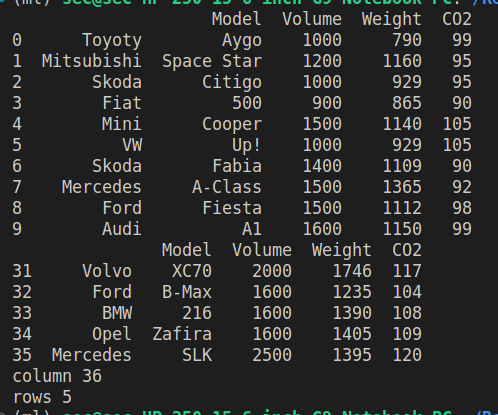

# Read-from-CSV

## AIM:
to write a python program for reading content from csv file

## ALGORITHM:
### Step 1:
start the python
### Step 2:
import pandas
### Step 3:
mention the csv file which is to be read
### Step 4:
read the contents of the csv file using df.read function
### Step 5:
end the program
## PROGRAM:
```
'''
developed by: HARISH RAGAVENDRA S
reference number: 22008967
'''
import pandas as pd
df=pd.read_csv('nba.csv')
print(df.head(10))
print(df.tail())
print("column",len(df.axes[0]))
print("rows",len(df.axes[1]))

```
## OUTPUT:


## RESULT:
thus the experiment executed sucessfully